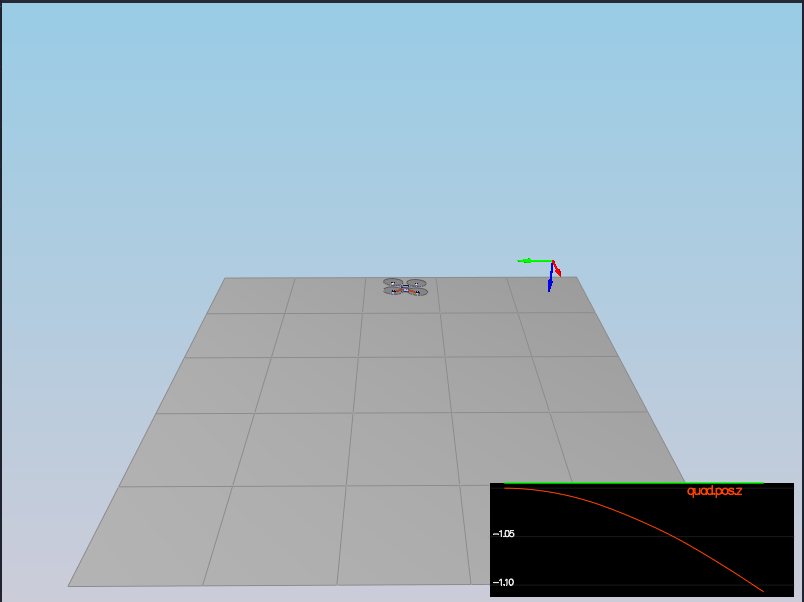
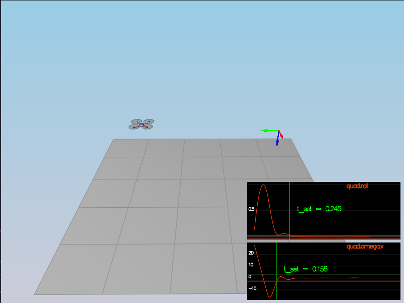
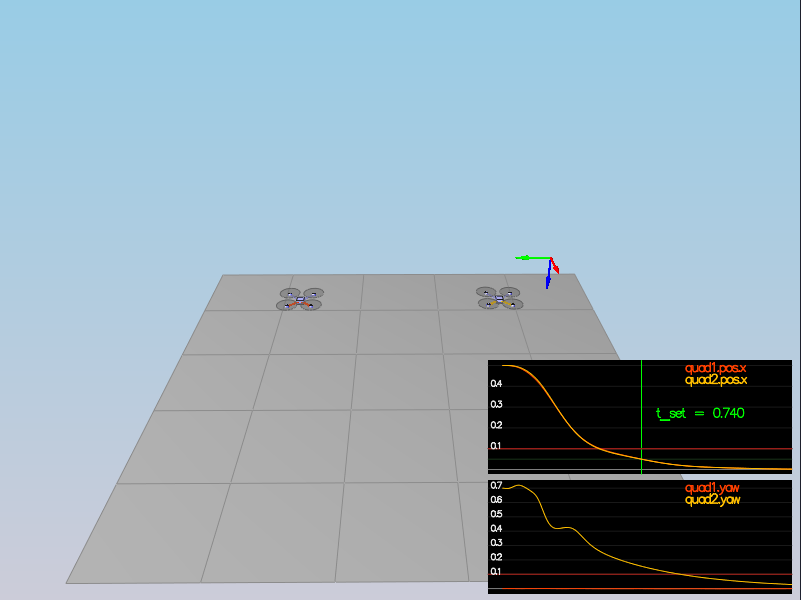
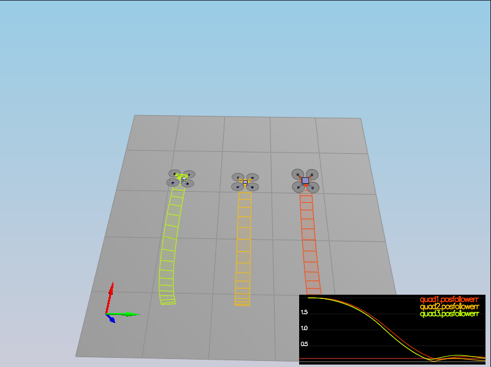
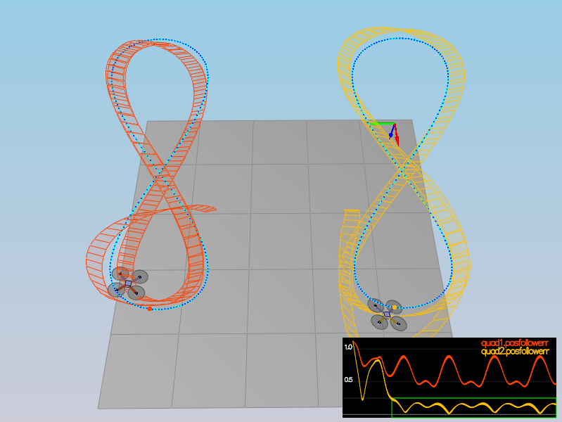

## Project: Controls
### Andrew Gutierrez, 3/24/21

### Scenerio 1: Intro

This first scenario is mostly just a test for the simulator to make sure everything is working. The mass control parameter was adjusted to more accurately reflect the physical properties of the system. As a result the craft hovers.

### Scenario 2: Body Rate and Roll/Pitch Control

The second scenario requires setting up a routine to convert a total thrust and set of x,y,z moments into the motor thrusts for each of the four motors. This is done in `QuadControl::GenerateMotorCommands()`. To do this, the force / torque equations were written using the defined constants and the four thrust values. This system of 4 linear equations can be represented as a matrix and then inverted to solve for each of the motor thrusts in terms of the inputs.
 
The actual body rate routine is setup to generate the moment commands used above. This is done in `QuadControl::BodyRateControl()`. This process requires applying a simple proportional gain and multiplying the output by the respective moments of inertia to convert from angular accelerations to moments. The gains for this control loop (`kpPQR`) were tuned to minimize overshoot and get to the target rotation rate as quickly as possible.

Finally, the pitch and roll control routines were implemented in `QuadControl::PitchRollControl()` to generate the P and Q rate commands needed to hold attitude. This also only uses proportional control like the body rate controller, however it uses the body transform determined by the current attitude, commanded horizontal accelerations and the commanded thrust to calculate the required body rates. The proportional gain `kpBank` is tuned here to keep a stable attitude. This process is less straight forward since it requires a transform between the body and world frames. In addition, the pitch and roll angle targets are constrained by the `maxTiltAngle` to preserve stability.

### Scenario 3: Position/Velocity and Yaw Control

For the third scenario, three new control loops were flushed out to enable full position control of the craft.
These loops are:
- Lateral position
- Altitude
- Yaw

There are two quads in this scenario with different initial states that should both go to a target x,y,z position at a target attitude.

The lateral position routine is located in `QuadControl::LateralPositionControl()` and uses a PD loop to generate x and y acceleration commands. It used velocity error in x and y for the derivative component of the loop and standard position error for the proportional. In addition there are limits to the acceleration and velocity commands for the vehicle so these are applied appropriately. Since these limits are given as magnitudes, there is some math involved to scale any vector over the limit to preserve the ration of the components while reducing the magnitude. The required tuning parameters for this portion are `kpVelXY` and `kpPosXY`.

The altitude control routine also uses a PD loop (even though an integral term is added later) and it is implemented in `QuadControl::AltitudeControl()`. For this loop, there is also a feed-forward acceleration term that is used to guide the controller. The Z acceleration value is output from the loop and then converted to a thrust command which is then passed to the more inner loops. At this point, the `kpPosZ` and `kpVelZ` parameters were tuned.

The yaw control routine is also relatively straight forward proportional control located in `QuadControl::YawControl()`. One note is yaw commands are given in radians between 0-2PI so there is an extra mathematical step in the loop to ensure this. At this point the `kpYaw` parameter was tuned.

### Scenario 4: Non-idealities and robustness 

For scenario 4, no new control loops were added. Instead it was an opportunity to refine the tune making the system more robust. This is important when the quads have different physical properties than those modeled in the code. The red quad is too heavy and the green has an off center CG, a properly tuned control system is able to handle this be incorporating the feedback it gets from the onboard sensors. Each of these quads will move towards a target position straight ahead then hold its position and attitude.

The only additional code added for this scenario is an integral term in the altitude control loop. This allows the quad to correct better for offsets from the target altitude. This is particularly useful in the case of the heavier quad since it tends to sit a little lower than the target position. With the addition of an integral term, the quad will accumulate error when it sits below the target and gradually increase thrust to go up.

### Scenario 5: Trajectory Following 

Like the fourth scenario, there is no additional code added for this scenario just additional tuning. The quads have to fly in a figure-eight to hit a constantly moving target position in a pre-determined trajectory. Because of the nature of the trajectory, this really requires an accurate tune as it will stress all of the control loops.

I found that my altitude gains were too high initially which ended up giving inconsistent thrust commands and this made everything much more difficult for the other loops since they often use thrust as an input.

### Wrap Up and Test Result 
After working through all the scenarios, I was able to get a tune that passes all the different tests and is robust enough to handle the problematic quads in scenario 4. I used the tuning guide to get a rough idea of the ratios of the various gains but I'm sure there are better tunes out there.